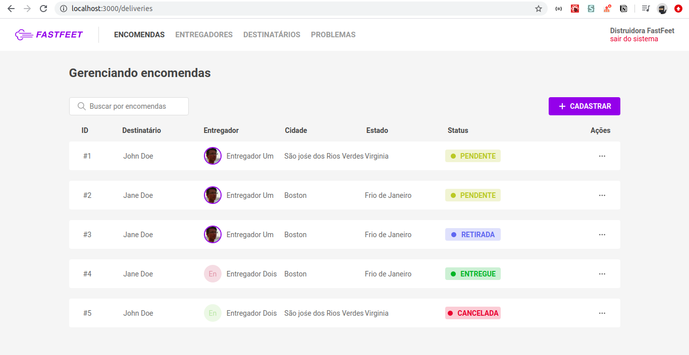

# FastFeet
Projeto final do Bootcamp da Rocketseat: um sistema para conectar entregadores e destinatários.

### Preview




### Instalação
Abra o terminal na sua máquina e execute:

```sh
git clone https://github.com/yudi-azvd/fastfeet-frontend.git
cd fastfeet-frontend
yarn 
yarn start
```

### Backend
Dê uma olhada [aqui](https://github.com/yudi-azvd/fastfeet-backend) para configurar o backend da aplicação.


### TODO's
Confira [aqui](https://github.com/yudi-azvd/fastfeet-frontend/issues/1).

